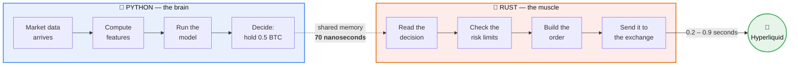
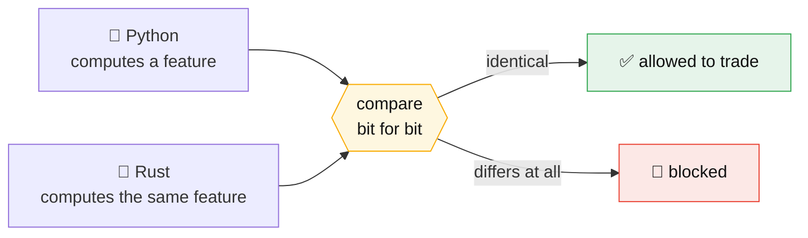
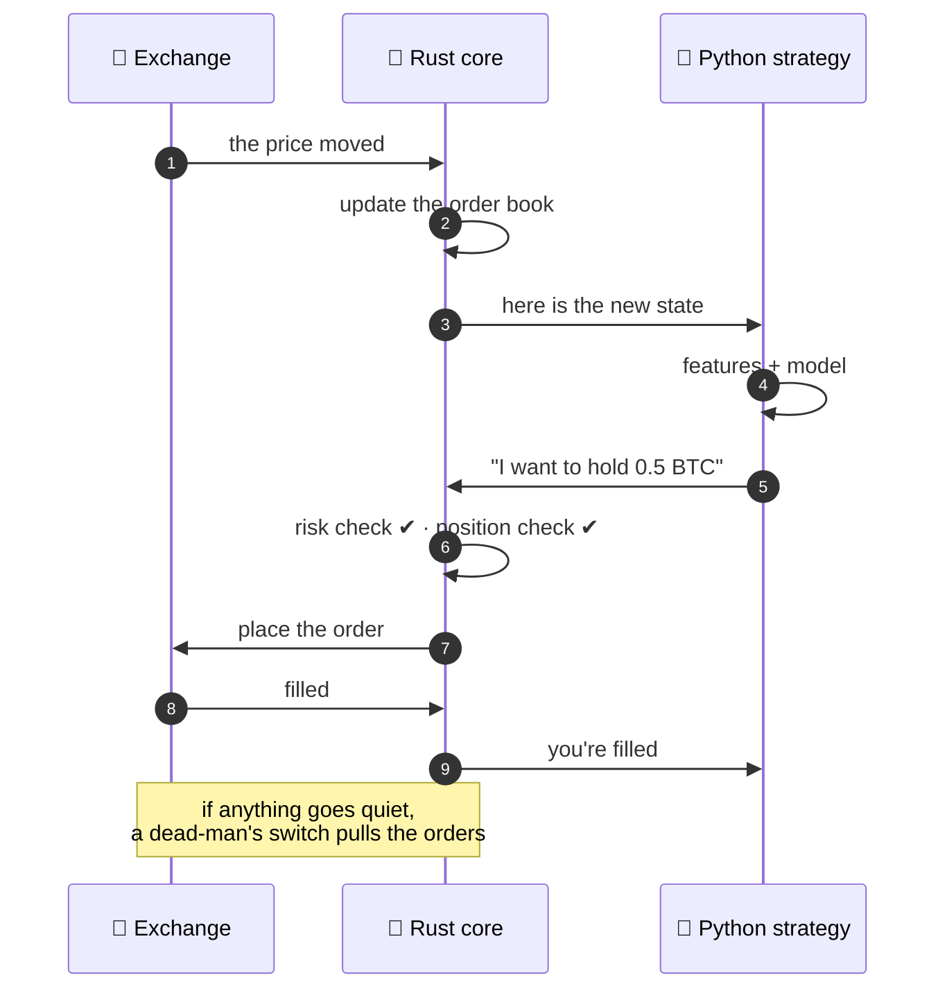

# Hyperliquid: Python ML → Rust Layer

**Write your trading strategy in Python. Let Rust execute it.**

You keep pandas, scikit-learn, XGBoost and PyTorch. You never rewrite a model in Rust.
A Rust core takes your strategy's decisions and turns them into live orders — quickly,
predictably, and identically every time.

Codename **Axon**: the wire that carries a signal from the Python *brain* to the Rust *muscle*.

---

## The idea in one picture



Python says **what** it wants. Rust works out **how** to get it, and deals with the exchange
saying no. Nothing is shared between them that either side can corrupt — decisions cross as
fixed-size records in a lock-free queue, one writer, one reader.

---

## Where the time actually goes

This is the part almost everyone gets wrong. Measured on real hardware, not quoted from a blog:

```
 Python → Rust handoff        70 ns   ▏
 Rust core wake-up cycle     366 µs   ▎
 Exchange round-trip     0.2 – 0.9 s  ████████████████████████████████████████
                                      └─ the exchange is >99.8% of the wait
```

**Put it on a human scale.** Suppose the Python→Rust handoff took **1 second**:

| Then this step… | …would take |
|---|---|
| 🐍→🦀 Handing the decision to Rust | **1 second** |
| ⏱️ Rust noticing there is work to do | **1.5 hours** |
| 🏦 The exchange confirming your order | **1 to 5 months** |

The language boundary is not the bottleneck. It was never going to be. Making it ten times
faster would change nothing you could measure.

> ### So why use Rust at all?

---

## Because the point isn't speed. It's never stalling.

An exchange order book is **first-come, first-served**. What costs you money isn't a slow
average — it's the one unpredictable moment your program pauses and somebody else takes your
place in the queue.

```
   A Python-only execution loop        The Rust execution core
   ───────────────────────────        ───────────────────────
   ▁▂▁▃▁▂█▁▂▁▄▁▂▁█▁▂▁▃▁▂▁▃▁           ▁▂▁▂▁▂▁▂▁▂▁▂▁▂▁▂▁▂▁▂▁▂▁▂
        ▲        ▲
   garbage    another                 steady, boring, predictable
   collector  pause                   — no surprise stalls
```

That's the real trade. Rust earns its place through four things:

| | What it buys you |
|---|---|
| 🎯 **Predictable timing** | No surprise pauses. The worst case stays close to the average. |
| ⚡ **Fast cancels** | Hyperliquid ranks cancels *first* within a block. Getting out cheaply is an edge. |
| 🛡️ **Risk checks nothing can skip** | Every order crosses position limits, rate caps and a kill switch. No bypass exists. |
| 🔁 **One code path** | The same engine runs the backtest and the live session, so what you tested is what trades. |

---

## Your strategy is not allowed to change

The quiet killer in ML trading: the model behaves one way in research and *slightly*
differently in production. Usually it isn't the model — it's the features feeding it.

So it gets checked mechanically, before anything is allowed to trade:



Not "close enough". **Identical, to the last bit.** Models stay in full precision — nothing is
compressed or quantized to make it faster, because that quietly changes what your strategy does.

---

## How one trade actually happens



If the strategy stops talking, the connection drops, or losses cross a line drawn in advance,
the system stops trading and gets itself flat. It doesn't wait for a human to notice.

---

## What's real today

This project is deliberately strict about the difference between *written*, *tested*, and
*actually proven against a live exchange*.

```
 ✅ PROVEN ON A LIVE EXCHANGE (testnet)
    ├─ live order book, trades, candles, funding
    ├─ orders placed, cancelled, modified — and filled
    ├─ a real ML model trading BTC and ETH for about an hour
    └─ our profit-and-loss accounting agreed with the exchange's own

 🔨 BUILT AND FULLY TESTED, NOT YET SEEN LIVE
    ├─ loss-based kill switch and automatic flatten
    ├─ several strategies sharing one account
    └─ portfolio-wide exposure limits

 📋 DESIGNED, NOT BUILT
    └─ trading with real money
```

**1,885 automated tests pass** (1,196 Rust + 689 Python), and none of them touch the network.
Everything above is **testnet** — this has never traded real money.

---

## Read more

The design documents are half the deliverable here, and they're written to be read:

| | |
|---|---|
| 🗺️ [**Vision & scope**](docs/00-vision-and-scope.md) | What this is, and what it deliberately isn't |
| 🏛️ [**Architecture**](docs/01-architecture.md) | How the pieces fit together |
| 🔌 [**The Python↔Rust boundary**](docs/02-python-rust-boundary.md) | How the two languages actually talk |
| ⏱️ [**Latency model**](docs/05-latency-model.md) | The numbers above, with their sources |
| ✅ [**Roadmap**](docs/08-roadmap.md) | Honest status: proven vs. built vs. written |
| 📚 [**38 decision records**](docs/adr/) | Every hard-to-reverse choice, and why |

Building and running it is covered in [docs/DEVELOPMENT.md](docs/DEVELOPMENT.md).

---

<sub>Hyperliquid is the first exchange adapter, not a dependency — the core is venue-agnostic by
design, and a Binance adapter is already in the tree. A research and educational project;
nothing here is financial advice.</sub>
